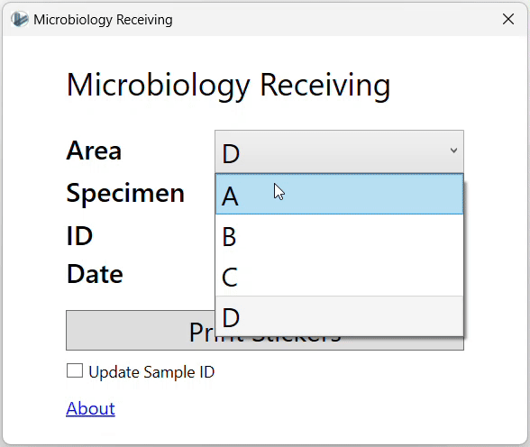

# Labrotory Samples Labeling

A Windows application for printing sample labels. It is intended to replace the sample tracking notebook and, hence, it stores data locally.

## Application Demo

- Data are stored in a local JSON file named `recentID.json`. For now, the user has to update the printer name in the JSON file.
- To update the sample ID, click on the `Update Sample ID` checkbox and click the `Print Stickers` button.

## Roadmap

- Store data in a remote database.

- Enable multi-client usage. For example, multiple computers at a lab should be able to print labels using this application.

- Implement dynamic fields. Labs should be able to add and remove fields to suit their needs.

- User Actions logging. Who printed what and when.

- Auto detect printers.

- Implement printer settings. It should be a simple version of Word printing settings.
